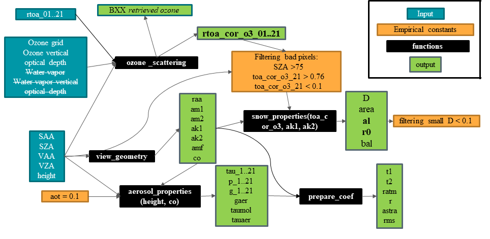
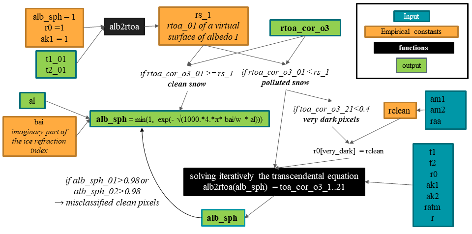
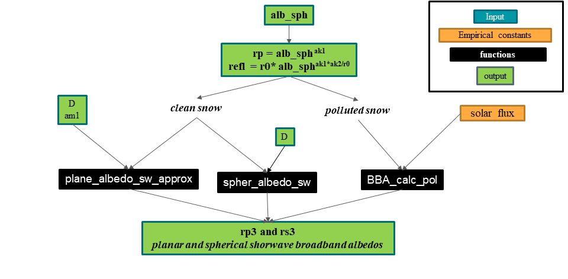

# pySICE
Python scripts behind the SICE toolchain for albedo retrieval.

by  B. Vandecrux (2), A. Kokhanovsky (1), J. Box (2)

(1) VITROCISET Belgium SPRL, Bratustrasse 7, 64293 Darmstadt, Germany
(2) Geological Survey of Denmark and Greenland (GEUS)
 Øster Voldgade 10, 1350 Copenhagen, Denmark


## Table of Contents  
* [Running environment](#running-environment)  
* [Theoretical background](#theoretical-background)  
* [Scripts description](#scripts-description)  
    * [Scripts overview](#scripts-overview)  
    * [Input preparation](#input-preparation)  
    * [Clean or polluted snow pixels](#clean-or-polluted-snow-pixels)  
    * [Bottom of the atmosphere reflectance and broadband albedo](#test)  
* [Installation](#installation)  
    * [Python](#python)
    * [Download pySICE](#download)
* [Examples](#examples)  
    * [pySICE](#pysice)
    * [Python interface for the fortran script sice.f	](#sicef)
	
## Running environment
developped on Python 3.7.6
uses numpy, rasterio, time and sys packages

## Theoretical background

The snow surface characteristics retrieval is based on the following work:
* [Kokhanovsky et al. (2018) On the reflectance spectroscopy of snow](https://tc.copernicus.org/articles/12/2371/2018/)
* [Kokhanovsky et al. (2019) Retrieval of Snow Properties from the Sentinel-3
Ocean and Land Colour Instrument](http://dx.doi.org/10.3390/rs11192280)
* [Kokhanovsky et al. (2020) The Determination of Snow Albedo from Satellite
Measurements Using Fast Atmospheric
Correction Technique](http://dx.doi.org/10.3390/rs12020234)

The ozone total ozone retreival is described in 
* [Kokhanovsky et al. (2020) Retrieval of the total ozone over Antarctica using Sentinel-3 ocean and land colour instrument](https://doi.org/10.1016/j.jqsrt.2020.107045)

The Algorithm Theoretical Basis Document is available [here](docs/atbd/FINAL_SICE_ATBD__v3.0_MAY06_2020.pdf)

## Scripts description

### Scripts overview


### Input needed

Input files:
|File |Description|
|----------|:-------------:|
| height.tif  | Height in metre|
| mask.tif| Ice mask|
| O3.tif   | Total column ozone|
| OZA.tif  | Observation zenith angle|
| OAA.tif  | Observation azimuth angle|
| r_TOA_01..21.tif | Top of the atmosphere OLCI reflectance|
| SZA.tif  | Solar Zenith angle|
| SAA.tif  | Solar azimuth angle|
| WV.tif  | Water vapor|

### Outputs

| File Name                            | Description                                                            | Units       |
|--------------------------------------+------------------------------------------------------------------------+-------------|
| grain_diameter.tif                   | Snow grain diameter                                                    | mm          |
| snow_specific_surface_area.tif       | Snow specific surface area                                             | m^{2}kg^{-1}|
| albedo_bb_planar_nir.tif             | near infrared broadband planar albedo                                  | 700-2400 nm |
| albedo_bb_planar_sw.tif              | shortwave broadband planar albedo                                      | 300-2400 nm |
| albedo_bb_planar_vis.tif             | visible broadband planar albedo                                        | 300-700 nm  |
| albedo_bb_spherical_nir.tif          | near infrared broadband spherical albedo                               | 700-2400 nm |
| albedo_bb_spherical_sw.tif           | shortwave broadband spherical albedo                                   | 300-2400 nm |
| albedo_bb_spherical_vis.tif          | visible broadband spherical albedo                                     | 300-700 nm  |
| rBRR_01..21.tif                      | bottom of the atmosphere surface reflectance (OLCI bands 1 through 21) |             |
| albedo_spectral_planar_01..21.tif    | spectral planar albedo (OLCI bands 1 to 11 and 16 to 21)               |             |
| albedo_spectral_spherical_01..21.tif | spectral spherical albedo (OLCI bands 1 to 11 and 16 to 21)            |             |
| diagnostic_retrieval.tif             | See next table                                                         |             |
| conc.tif                             | pollutant concentration (volumetric concentration)                     |             |
| al.tif                               | effective absorption length(mm)                                        |             |
| r0.tif                               | reflectance of a semi-infinite non-absorbing snow layer                |             |
| 03_SICE.tif                          | total ozone product (OLCI) corrected for ozone scattering              |             |


| Diagnostic Code | Description                                                                                   |
|-----------------+-----------------------------------------------------------------------------------------------|
|               0 | clean snow                                                                                    |
|               1 | polluted snow                                                                                 |
|               3 | partially snow covered pixel                                                                  |
|               6 | polluted snow for which r0 was calculated and not derived from observations                   |
|               7 | polluted snow of calculated spherical albedo in bands 1 and 2 >0.98 reprocessed as clean snow |
|             100 | sza<75, no retrival                                                                           |
|             102 | TOA reflectance at band 21 < 0.1, no retrieval                                                |
|             103 | TOA reflectance at band 1 < 0.2, no retrieval                                                |
|             104 | grain_diameter < 0.1, no retrieval, potential cloud flag                                      |
|             105 | retrieved spherical albedo negative in band 1, 2 or 3                                         |
|              -n | impossible to solve snow spherical albedo equation at band n                                   |
  


### Clean or polluted snow pixels


<a name="test"/>

### Bottom of the atmosphere reflectance and broadband albedo


## Installation

# Python

We recommend the use of [Anaconda](https://www.anaconda.com/products/individual) and recent version of Python (>3.7).


<a name="download"/>

# Download pySICE

Download the repository using the browser or typing in your command prompt

```
git clone https://github.com/BaptisteVandecrux/pySICE.git
cd pySICE
```

## Examples

Test input files are available [here](https://www.dropbox.com/s/b7wbervqls0p5cc/S3_test_data.zip?dl=0). Download and unzip using browser or with: 

```
wget https://www.dropbox.com/s/b7wbervqls0p5cc/S3_test_data.zip
unzip S3_test_data.zip -d S3_test_data
```


### pySICE

Simply run:


```
python sice.py ./S3_test_data
```

The output is added to the S3_test_data folder.


<a name="sicef"/>

### Python interface for the fortran script sice.f
sice_f.py reads the SICE-generated S3 geotiff files, converts them into ascii files, compiles and runs sice.f, reads the text outputs and save them into geotiff again.

Compile sice.f:

```
gfortran ./fortran/sice.f -o ./fortran/sice.exe
```

Create the output folder and run the script:

```
mkdir S3_test_data/fortran
python fortran/sice_f.py ./S3_test_data
```


